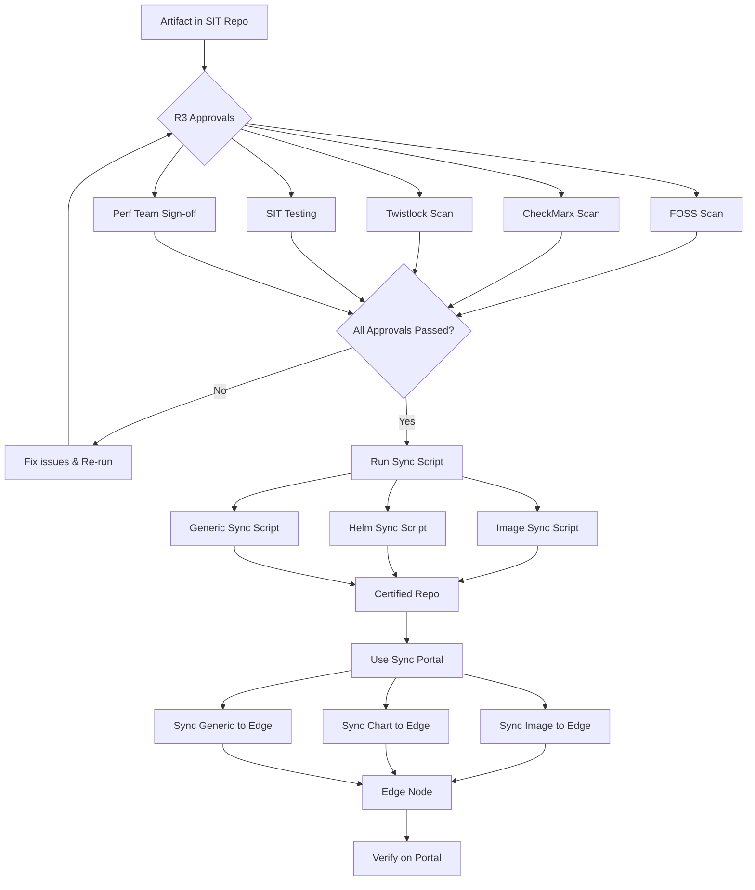

# Artifact Sync Process — SIT → Certified → Edge Node

This document describes the end-to-end process for syncing artifacts across our JFrog repositories and onto edge nodes. It covers all three artifact types: **Docker Images**, **Helm Charts**, and **Generic Files**.

---

## Table of Contents

1. [Overview](#overview)
2. [Artifact Types](#artifact-types)
3. [Repository Structure](#repository-structure)
4. [Process Flow Diagram](#process-flow-diagram)
5. [Prerequisites — R3 Approvals](#prerequisites--r3-approvals)
6. [Step 1: Sync from SIT Repo to Certified Repo](#step-1-sync-from-sit-repo-to-certified-repo)
7. [Step 2: Sync from Certified Repo to Edge Node](#step-2-sync-from-certified-repo-to-edge-node)
8. [Verification](#verification)
9. [Troubleshooting](#troubleshooting)

---

## Overview

The artifact sync process moves validated artifacts through three stages:

```
SIT Repo  ──►  Certified Repo  ──►  Edge Node
```

Artifacts can only progress to the next stage after passing the required gates at the current stage.

---

## Artifact Types

| Type | Description | Example |
|------|-------------|---------|
| **Image** | Docker / container images | `<placeholder-image-name>:<tag>` |
| **Helm Chart** | Kubernetes Helm packages | `<placeholder-chart-name>-<version>.tgz` |
| **Generic File** | Any other binary/file artifact | `<placeholder-file-name>` |

---

## Repository Structure

All repositories below are hosted on **JFrog Artifactory**.

### SIT Repositories

| Artifact Type | Repository Name |
|---------------|-----------------|
| Image | `ai-next-sit-image-repo` |
| Helm Chart | `ai-next-sit-helm-repo` |
| Generic | `ai-next-generic-image-repo` |

### Certified Repositories

| Artifact Type | Repository Name |
|---------------|-----------------|
| Image | `<placeholder-certified-image-repo>` |
| Helm Chart | `<placeholder-certified-helm-repo>` |
| Generic | `<placeholder-certified-generic-repo>` |

> **Note:** Please replace certified repo names with the correct values for your environment.

---

## Process Flow Diagram



---

## Prerequisites — R3 Approvals

Before any artifact can be synced from the SIT repo, **all of the following R3 approvals must be completed and signed off**:

| # | Approval Gate | Owner / Tool | Purpose |
|---|---------------|--------------|---------|
| 1 | **FOSS** | FOSS Compliance Team | Open-source license & compliance check |
| 2 | **CheckMarx** | Security Team | Static application security testing (SAST) |
| 3 | **Twistlock** | Security Team | Container image vulnerability scan |
| 4 | **SIT Testing** | QA / SIT Team | System integration testing sign-off |
| 5 | **Perf Team** | Performance Team | Performance benchmarks & sign-off |

> ⚠️ **Do not proceed** to Step 1 until every gate above is green.

---

## Step 1: Sync from SIT Repo to Certified Repo

Once all R3 approvals are obtained, use the appropriate script below to sync each artifact type from the SIT repository to the Certified repository.

### 1.1 Sync Docker Images

```bash
# Image sync script
<placeholder-image-sync-script-command>
```

**Source:** `ai-next-sit-image-repo`
**Destination:** `<placeholder-certified-image-repo>`

### 1.2 Sync Helm Charts

```bash
# Helm chart sync script
<placeholder-helm-sync-script-command>
```

**Source:** `ai-next-sit-helm-repo`
**Destination:** `<placeholder-certified-helm-repo>`

### 1.3 Sync Generic Files

```bash
# Generic file sync script
<placeholder-generic-sync-script-command>
```

**Source:** `ai-next-generic-image-repo`
**Destination:** `<placeholder-certified-generic-repo>`

---

## Step 2: Sync from Certified Repo to Edge Node

After all artifacts are present in the Certified repositories, use the **Sync Portal** to push them to the edge node.

### Portal Links

| Artifact Type | Portal Link |
|---------------|-------------|
| Image | `<placeholder-portal-link-for-image>` |
| Helm Chart | `<placeholder-portal-link-for-chart>` |
| Generic | `<placeholder-portal-link-for-generic>` |

### Portal Steps (General)

1. Log in to the Sync Portal using your credentials.
2. Navigate to the appropriate section (Image / Chart / Generic).
3. Select the artifact and version to be synced.
4. Choose the target edge node(s).
5. Trigger the sync and monitor the status until it completes.

---

## Verification

After completing the edge node sync, verify the artifact is successfully deployed:

```text
<placeholder-portal-verification-steps>
```

Typical verification checklist:

- [ ] Artifact appears in the target edge node listing on the portal.
- [ ] Artifact version matches what was synced from the Certified repo.
- [ ] Sync status shows **SUCCESS** / **COMPLETED**.
- [ ] No errors in the sync logs.

---

## Troubleshooting

| Issue | Possible Cause | Action |
|-------|----------------|--------|
| Sync script fails | Missing R3 approval or credentials | Re-check all approval gates and JFrog credentials |
| Artifact not in Certified repo | SIT-to-Certified sync incomplete | Re-run the appropriate sync script |
| Portal sync stuck | Network / edge node unreachable | Contact infra team; re-trigger after resolution |
| Version mismatch on edge | Wrong tag/version selected on portal | Re-sync with the correct version |

---

## Quick Reference

```
┌──────────────┐    R3 Approvals    ┌──────────────────┐    Sync Portal    ┌────────────┐
│   SIT Repo   │  ────────────────► │  Certified Repo  │  ───────────────► │  Edge Node │
└──────────────┘    + Scripts       └──────────────────┘                   └────────────┘
```

---

**Document Owner:** `<placeholder-team-or-owner-name>`
**Last Updated:** `<placeholder-date>`
**Version:** `1.0`
